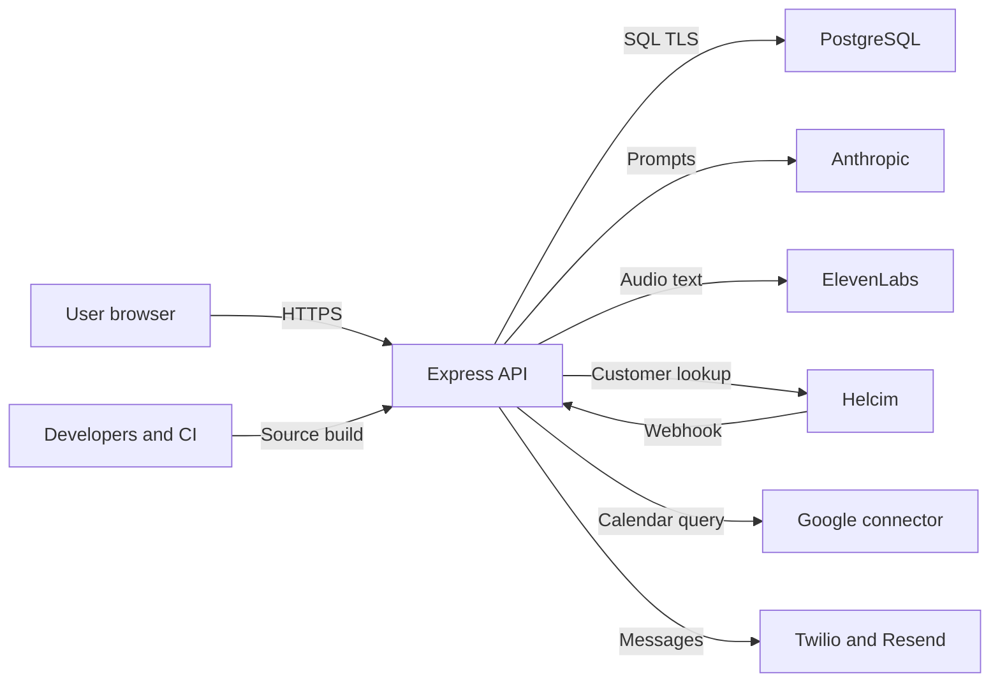

# Kindred-Asterling-AI-Coaching Threat Model

## Executive summary

Kindred is currently local-only, so immediate remote likelihood is low, but its planned internet-facing design handles high-sensitivity wellness, medication, chat, contact, payment, and calendar data. The leading deployment blockers are entitlement decisions based on unverified email, incomplete Helcim webhook-to-subscription state handling, reusable raw session IDs combined with unverifiable database TLS, and real private data committed under `attached_assets/`. The code already has strong tenant scoping, Zod validation, bounded AI/tool payloads, signed webhook handling, and rate limits; these controls materially reduce IDOR, injection, and cost-abuse risk.

## Scope and assumptions

- In scope: `artifacts/api-server/**`, `artifacts/kindred-coach/**`, `lib/api-*`, `lib/db/**`, `lib/integrations-*`, deployment manifests, CI workflows, repository secret handling, and tracked `attached_assets/**`.
- Runtime scope: Express 5 API, React/Vite web client, PostgreSQL/Drizzle, Anthropic, ElevenLabs, Helcim/Stripe code, Google Calendar connector, Twilio, Resend, and the reminder scheduler.
- Context-only: tests, generated API clients/schemas, scripts, and the existing `threat_model.md`.
- Out of runtime scope: `node_modules`, build output, and `artifacts/mockup-sandbox/**` unless separately deployed.
- Validated context: the app is local-only today; signup email is not verified; Helcim is the intended payment provider; the private repository contains real operator/user data.
- Deployment assumption: Railway/Replit manifests indicate eventual public deployment, so findings note where priority increases when internet exposure is enabled.

Open questions that would change ranking:

- Whether `SUBSCRIPTION_BYPASS_EMAILS` is populated in any deployed environment.
- How Helcim subscription rows are initially created or updated outside the code currently in this tree.
- Whether production PostgreSQL is reached only through a private provider network or across a network where certificate verification is required.

## System model

### Primary components

- React/Vite browser client: authenticated wellness UI and API consumer (`artifacts/kindred-coach/src/App.tsx`, `lib/api-client-react/src/custom-fetch.ts`).
- Express API: request parsing, CORS, sessions, rate limits, subscription gate, business routes, static frontend (`artifacts/api-server/src/app.ts`, `artifacts/api-server/src/routes/index.ts`).
- PostgreSQL: users, raw session IDs, profiles, chat, wellness records, medication state, reminders, and subscription cache (`lib/db/src/index.ts`, `lib/db/src/schema/**`).
- AI and voice providers: Anthropic coaching/tool loop and ElevenLabs speech services (`artifacts/api-server/src/routes/chat.ts`, `artifacts/api-server/src/lib/elevenlabs.ts`).
- Payment providers: Helcim webhook/lookup path and residual Stripe lookup code (`artifacts/api-server/src/routes/subscription.ts`, `artifacts/api-server/src/lib/helcimClient.ts`, `artifacts/api-server/src/lib/stripeClient.ts`).
- Connector and messaging providers: Replit Google Calendar connector, Twilio, and Resend (`googleCalendar.ts`, `twilio.ts`, `resend.ts`).
- Scheduler: once-per-minute process that reads all enabled users and sends reminders (`artifacts/api-server/src/lib/reminderScheduler.ts`).

### Data flows and trust boundaries

- Browser -> Express API: credentials, session cookie or bearer session ID, chat, health records, medication data, profile/contact details, and audio over HTTPS/JSON or raw HTTP bodies. CORS is allow-listed, cookies are `HttpOnly`, `Secure` in production, and `SameSite=Lax`; JSON is capped at 32 KB, voice at 10 MB, and write/general/chat rate limits apply. Most domain bodies use generated Zod schemas.
- Express API -> PostgreSQL: credentials hashes, raw session IDs, PII, wellness/medication data, chats, and entitlement cache over PostgreSQL TLS. Drizzle parameterization and pervasive `req.user.id` predicates provide query and tenant controls. Production TLS explicitly sets `rejectUnauthorized: false`.
- Express API -> Anthropic: user chat, bounded recent history, selected profile data, and user-scoped tool results over provider HTTPS. Message/history/tool output and iteration caps exist; the provider receives highly sensitive data by design.
- Express API -> ElevenLabs: authenticated users' audio or requested speech text over provider HTTPS. Size limits and route-level rate limits exist; content-type is accepted from the request and forwarded as metadata.
- Helcim -> Express webhook: payment events over public HTTPS with HMAC signature and a five-minute timestamp window. Unsigned requests receive a no-op 200; signed events are parsed, but the route does not directly persist event state or deduplicate event IDs.
- Express API -> Helcim/Stripe: API credentials and customer lookup data over HTTPS. Entitlement can be linked by email; application email ownership is not verified.
- Express API -> Google connector: calendar query and owner calendar events through a project-scoped connector. Access is restricted to `CALENDAR_OWNER_USER_ID` and fails closed when unset.
- Scheduler -> Twilio/Resend: phone/email destinations plus wellness or medication reminder text over provider HTTPS. Send calls have ten-second timeouts and delivery deduplication.
- Git working tree -> CI/build/deployment: source, lockfile, workflows, and Docker context. `.dockerignore` excludes env files and attachments, while the private Git repository still contains 63 real-data attachments.

#### Diagram

## Assets and security objectives

| Asset | Why it matters | Security objective (C/I/A) |
|---|---|---|
| Chat and coaching history | Contains intimate mental-health disclosures and AI context | C/I/A |
| Wellness and medication records | Reveals mood, symptoms, routines, medication use, and effectiveness | C/I/A |
| Profile, email, phone, birthday | Identifying and contact data; some fields enter the model prompt | C/I |
| Session IDs and password hashes | Session IDs are directly reusable; hashes protect accounts | C/I |
| Subscription entitlement | Controls paid access and revenue integrity | I/A |
| Provider and database credentials | Permit data access, messaging, AI/voice spend, or service takeover | C/I |
| Calendar events | Builder-scoped external schedule can reveal sensitive appointments | C/I |
| Reminder destinations and content | Can disclose medication/wellness details to third parties or lock screens | C/I |
| Tracked repository attachments | Real screenshots, chats, PDFs, support data, and security exports | C/I |
| Service and provider quotas | Chat, voice, database, SMS, and email availability/cost | A |

## Attacker model

### Capabilities

- A local user today, or an unauthenticated internet user after deployment, can register accounts, submit credentials, and send bounded request bodies.
- An authenticated subscriber can submit adversarial chat/profile content, invoke AI tools, upload audio, request TTS, and create sensitive records.
- An attacker may know another person's email address, guess numeric resource IDs, automate requests, or attempt forged/replayed payment callbacks.
- A repository collaborator, compromised developer account, CI runner, database credential holder, or network-positioned database attacker may reach higher-value assets.

### Non-capabilities

- No evidence shows direct shell execution, arbitrary file upload/storage, server-side URL fetching from user-supplied URLs, or dynamic code evaluation in production routes.
- The model cannot select a target user ID; tool execution receives the authenticated server-side user ID.
- Calendar access is not available to every user and fails closed unless the authenticated ID matches the configured owner.
- Current local-only exposure means anonymous remote attackers cannot reach the service unless the operator publishes or tunnels it.

## Entry points and attack surfaces

| Surface | How reached | Trust boundary | Notes | Evidence (repo path / symbol) |
|---|---|---|---|---|
| Registration/login/logout | `/api/auth/*` | Client -> API -> DB | No email verification, MFA, password maximum, or dedicated credential throttle | `routes/auth.ts`; `rateLimiter.ts` |
| Session authentication | Cookie or bearer `sid` | Client -> API -> DB | Random 256-bit IDs, seven-day TTL, stored raw and accepted as bearer tokens | `lib/auth.ts`; `authMiddleware.ts` |
| Wellness/medication/profile APIs | Authenticated `/api/*` | Client -> API -> DB | Strong user scoping and generated Zod validation | `routes/*.ts`; `lib/api-zod/src/generated/api.ts` |
| Chat agent and tools | `/api/chat/send` | Client -> API -> AI -> DB | Sensitive outbound prompts; bounded history, tools, output, iterations, and per-user reads | `routes/chat.ts`; `lib/chatTools.ts` |
| Voice API | `/api/voice/*` | Client -> API -> ElevenLabs | Auth/subscription inherited from router; 10 MB STT and 5,000-char TTS caps | `routes/index.ts`; `routes/voice.ts` |
| Payment webhook | `/api/payment/webhook` | Helcim/Internet -> API -> DB | Signature/timestamp checked; no event-ID ledger and no explicit event-state persistence | `routes/subscription.ts`; `lib/helcimClient.ts` |
| Subscription resolution | Status and global gate | API -> payment provider/DB | Email-linked checks and email bypass; Helcim branch relies on cached rows | `subscriptionService.ts`; `requireSubscription.ts` |
| Calendar | `/api/calendar/upcoming` | API -> project connector | Owner ID allow-list protects builder-scoped data | `routes/calendar.ts`; `lib/googleCalendar.ts` |
| Reminder scheduler | Internal cron every minute | DB -> Twilio/Resend | Reads all enabled users and sends potentially sensitive text | `lib/reminderScheduler.ts`; `twilio.ts`; `resend.ts` |
| PDF export | `/api/weekly-report/pdf` | Client -> API -> DB | User-scoped but exports high-sensitivity records; no-store headers are absent | `routes/weeklyReport.ts` |
| Repository and CI | Git clone, PR, build | Developer/CI -> artifacts | Private repo contains real attachments; CodeQL and Codacy exist | `attached_assets/**`; `.github/workflows/**` |

## Top abuse paths

1. Access paid features: attacker registers a known payer or bypass-listed email -> no ownership proof occurs -> entitlement logic associates access with the session email -> attacker reaches sensitive paid routes.
2. Preserve or corrupt entitlement: attacker or provider replays a valid Helcim event inside accepted conditions -> no event-ID ledger exists -> incomplete event handling fails to establish an auditable state transition -> access becomes stale or inconsistent.
3. Steal all user sessions: attacker obtains database access or intercepts a database connection with unverifiable TLS -> reads raw `sid` values -> replays them as bearer tokens -> accesses wellness and chat data.
4. Expose private records through source access: developer/CI account is compromised -> attacker clones the private repository -> downloads tracked chat exports, screenshots, PDFs, and security CSV -> real operator/user data leaves the controlled environment.
5. Abuse accounts after deployment: attacker distributes login/register attempts across IPs or manipulates proxy-derived identity -> general write limits are diluted -> credentials are stuffed or large numbers of users/sessions are created -> account or database abuse.
6. Manipulate coaching context: authenticated user stores prompt-like profile/chat content -> Anthropic receives it with sensitive tool results -> model behavior is redirected or unsafe coaching is produced -> privacy or user-safety harm occurs, although cross-user tool access remains server-blocked.
7. Leak medication context: user enables SMS/email reminders and later loses control of the address/number or notifications appear on a shared device -> scheduler sends medication names/times -> a third party learns health information.
8. Consume provider budget: paid account repeatedly invokes bounded chat, STT, and TTS routes -> per-user limits slow but do not impose daily spend quotas -> AI/voice budget and service capacity are consumed.

## Threat model table

| Threat ID | Threat source | Prerequisites | Threat action | Impact | Impacted assets | Existing controls (evidence) | Gaps | Recommended mitigations | Detection ideas | Likelihood | Impact severity | Priority |
|---|---|---|---|---|---|---|---|---|---|---|---|---|
| TM-001 | Unauthenticated registrant | Deployment is reachable and a payer/bypass email is known and not already safely bound | Register an unverified email and inherit email-based entitlement or bypass | Unauthorized paid access and possible account preemption | Entitlement, user identity, revenue | Unique email; bcrypt; session entropy (`auth.ts`, `auth.ts` schema) | No ownership proof; `SUBSCRIPTION_BYPASS_EMAILS` and provider lookup are email-based | Require email verification before session privilege; bind provider customer/subscription IDs to a verified user; replace email bypass with immutable user IDs and startup validation | Alert on registration followed by immediate bypass/provider match; log entitlement source and immutable provider ID | Medium now; high after public deployment | High | high |
| TM-002 | DB/network attacker or leaked DB credential | Access to database traffic or contents | Read raw session IDs and replay them as cookie/bearer credentials | Full account impersonation and sensitive-data disclosure | Sessions, all user data | 256-bit random IDs, expiry, HttpOnly/Secure cookies (`lib/auth.ts`, `routes/auth.ts`) | Raw bearer-equivalent IDs stored in DB; production TLS disables certificate verification; old sessions are not globally revoked | Store only a keyed hash of session IDs; verify DB certificates/CA; rotate sessions on privilege changes; add user-wide revocation and periodic expiry cleanup | Alert on one session used from new geographies/devices; monitor DB TLS and session-table reads | Low in local-only mode; medium when deployed | High | medium |
| TM-003 | Compromised developer, collaborator, CI, or backup | Read access to private repository | Clone tracked real-data attachments | Disclosure of chats, screenshots, support records, and security metadata | Repository attachments, PII | Private repository; Docker excludes `attached_assets` (`.dockerignore`) | 63 real-data files are versioned and persist in Git history | Remove real data from current tree and history; store evidence in access-controlled case storage; add pre-commit/CI PII and secret scanning | Audit clone/download events; alert on repository visibility changes and bulk artifact access | Medium | High | high |
| TM-004 | Internet account attacker | Public exposure and reusable passwords or mass signup | Credential stuffing, password guessing, or account/session creation abuse | Account takeover, DB growth, support burden | Accounts, sessions, user data, availability | bcrypt cost 12; generic login failure; IP/user rate limits; 32 KB body cap | No verified email, MFA, breached-password check, dedicated auth limiter, lockout/backoff, or CAPTCHA; `trust proxy=1` must match topology | Add auth-specific IP+account throttles, progressive backoff, email verification, optional MFA/passkeys, breached-password screening, and proxy integration tests | Alert on failures by email/IP/ASN, registration bursts, and session creation anomalies | Low now; medium after deployment | High | medium |
| TM-005 | Payment event attacker, integration fault, or operator error | Helcim mode and cached entitlement rows | Replay events or exploit incomplete webhook-to-state mapping so status remains stale or unauditable | Unauthorized continued access or denial of paid access | Entitlement, revenue, availability | HMAC verification, five-minute timestamp, fail-closed provider configuration (`helcimClient.ts`, `subscriptionService.ts`) | No event-ID dedup; string comparison is not timing-safe; webhook calls resolver but does not explicitly map/persist event state; signed failures still return 200 | Parse with a strict event schema; timing-safe signature compare; persist unique event IDs; transactionally map accepted event types to provider/customer/subscription state; return retryable status on transient processing failure | Audit every event ID, type, customer binding, old/new status, and processing outcome; alert on stale active rows | Medium when Helcim is enabled | High | high |
| TM-006 | Authenticated user and untrusted model output | Subscriber can control chat/profile text | Inject instructions, induce unsafe coaching, or cause excess sensitive context to be sent to the provider | Privacy harm, misleading health guidance, provider data exposure | Chat, profile, wellness data, user safety | No-diagnosis instruction; per-user tools; field/history/tool/output caps; max four tool iterations (`chat.ts`, `chatTools.ts`) | User profile text is concatenated into the system message; no explicit crisis/escalation policy, provider retention control evidence, or output safety evaluation | Delimit untrusted profile fields; minimize tool data; document provider retention/DPA; add crisis/self-harm response policy and regression tests; keep output rendered as text | Log tool names and sizes without content; sample safety classifications; alert on repeated tool loops and provider policy failures | Medium | High | medium |
| TM-007 | Stale destination, shared device, messaging provider, or account attacker | Reminders enabled with phone/email | Receive or expose medication/wellness reminder content | Health-information disclosure and user harm | Medication data, contact data, reminders | Opt-in channel flags, authenticated settings, delivery dedup, request timeouts (`reminders.ts`, `reminderScheduler.ts`) | Medication names/times can appear in SMS/email and lock-screen previews; no destination verification or re-consent lifecycle | Verify phone/email before enabling; default to privacy-preserving reminder text; offer content sensitivity setting; re-confirm destinations periodically; document provider handling | Track destination changes and delivery failures; notify user when channels are enabled or changed | Medium | Medium | medium |
| TM-008 | Authenticated subscriber | Valid paid account | Repeatedly invoke chat, voice transcription, or TTS within rolling limits | Provider cost and degraded availability | AI/voice quotas, API availability | General/write/chat limits, body/history/token/tool caps (`rateLimiter.ts`, `chat.ts`, `voice.ts`) | No daily per-account/provider budgets, concurrency caps, or circuit breaker; voice uses generic write limit | Add daily token/audio quotas, concurrent-call limits, provider timeouts for every call, budget alarms, and emergency feature flags | Export provider usage/cost by user and endpoint; alert on sudden spend or 429/5xx increases | Medium after deployment | Medium | medium |
| TM-009 | Cross-site attacker or injected frontend content | Victim is logged in; malicious same-site/subdomain or XSS context exists | Trigger authenticated writes or frame the app | Record tampering, unwanted sends, UI redress | Record integrity, sessions | `SameSite=Lax`, CORS allow-list, state-changing POST/PATCH/DELETE, React escaping (`app.ts`, `auth.ts`) | No CSRF token/Origin enforcement; no Helmet/CSP/HSTS/frame policy in Express | Enforce Origin/Referer on cookie-authenticated writes or use CSRF tokens; add Helmet with CSP, HSTS, frame ancestors, nosniff, and referrer policy | Log rejected origins and CSRF failures; CSP reporting | Low now; medium after deployment | Medium | medium |
| TM-010 | Supply-chain attacker or vulnerable dependency | Build/install or reachable vulnerable library behavior | Compromise build dependency or trigger known parser weakness | Build integrity loss or application DoS | Build artifacts, credentials, availability | Lockfile, one-day minimum release age, CodeQL, Codacy, overrides (`pnpm-workspace.yaml`, `.github/workflows/**`) | `pnpm audit --prod` reports two moderate and one low issue; `protobufjs` resolves below 8.6.6; some GitHub actions use mutable major tags | Upgrade/override `protobufjs >=8.6.6`; remove unused Gemini runtime dependencies; pin third-party actions by commit SHA; produce SBOM and scan images | Fail CI on exploitable production advisories; monitor lockfile/action changes | Low given no user-controlled proto parsing found | Medium | low |

## Criticality calibration

- Critical: pre-auth remote code execution; unauthenticated bulk extraction of chat/medication data; a payment/auth bypass that also grants cross-user data access.
- High: verified unauthorized subscription access through identity misbinding; theft of provider/DB credentials; compromise of reusable sessions at scale; public release of the tracked real-data attachments.
- Medium: credential stuffing against one account; targeted reminder privacy disclosure; sustained AI/voice cost abuse; stale payment state; prompt injection that affects the requesting user's coaching.
- Low: dependency advisories with no reachable attacker-controlled parser; minor health endpoint disclosure; noisy local-only denial of service with easy operator recovery.

Current local-only exposure reduces likelihood, not impact. TM-001, TM-004, TM-005, TM-008, and TM-009 should be re-ranked immediately before any public deployment.

## Focus paths for security review

| Path | Why it matters | Related Threat IDs |
|---|---|---|
| `artifacts/api-server/src/routes/auth.ts` | Registration, password policy, cookie creation, and missing email ownership proof | TM-001, TM-004, TM-009 |
| `artifacts/api-server/src/lib/auth.ts` | Raw bearer-equivalent session storage, TTL, and revocation behavior | TM-002, TM-004 |
| `artifacts/api-server/src/middlewares/rateLimiter.ts` | Auth, write, chat, IP, and proxy-dependent abuse controls | TM-004, TM-008 |
| `artifacts/api-server/src/routes/subscription.ts` | Public webhook and checkout/status entry points | TM-001, TM-005 |
| `artifacts/api-server/src/lib/subscriptionService.ts` | Email bypass, provider choice, cache freshness, and entitlement decisions | TM-001, TM-005 |
| `artifacts/api-server/src/lib/helcimClient.ts` | Signature verification, parsing, customer lookup, and replay handling | TM-005 |
| `artifacts/api-server/src/app.ts` | Proxy trust, CORS, parsers, security headers, global middleware ordering | TM-004, TM-009 |
| `lib/db/src/index.ts` | Production database TLS verification | TM-002 |
| `lib/db/src/schema/auth.ts` | Session and identity data model | TM-001, TM-002 |
| `artifacts/api-server/src/routes/chat.ts` | Sensitive prompt construction, agent loop, cost bounds, and output handling | TM-006, TM-008 |
| `artifacts/api-server/src/lib/chatTools.ts` | Cross-tenant protection and minimization of model-visible records | TM-006 |
| `artifacts/api-server/src/routes/voice.ts` | Large binary input and billable provider calls | TM-008 |
| `artifacts/api-server/src/lib/reminderScheduler.ts` | Cross-user batch processing and health-sensitive outbound content | TM-007 |
| `artifacts/api-server/src/lib/twilio.ts` | SMS destination normalization, provider errors, and sensitive content | TM-007 |
| `artifacts/api-server/src/lib/resend.ts` | Email delivery of sensitive reminders | TM-007 |
| `artifacts/api-server/src/routes/calendar.ts` | Protects project-scoped external calendar data | TM-006 |
| `artifacts/api-server/src/routes/weeklyReport.ts` | High-sensitivity PDF export and response caching behavior | TM-009 |
| `attached_assets/**` | Versioned real-data files and long-lived Git history exposure | TM-003 |
| `.dockerignore` and `Dockerfile` | Build-context exclusions and oversized runtime image contents | TM-003, TM-010 |
| `pnpm-workspace.yaml` and `pnpm-lock.yaml` | Dependency policy and current vulnerable `protobufjs` resolution | TM-010 |
| `.github/workflows/**` | CI permissions, action pinning, SAST, and supply-chain boundary | TM-010 |

## Quality check

- [x] Covered all discovered HTTP routes by route group, plus scheduler, CI/build, and repository artifacts.
- [x] Represented every identified external trust boundary in the system model and at least one threat.
- [x] Separated production runtime, local-only current exposure, dev/test tooling, generated code, and repository-only data.
- [x] Reflected user clarification: local-only deployment, unverified email with Helcim, private repository with real attachment data.
- [x] Recorded open questions and conditional public-deployment rankings.
- [x] Did not print or reproduce secret values.
- [x] Dependency scan recorded: three production-chain advisories (one low, two moderate), with `protobufjs >=8.6.6` recommended.
- [ ] Typecheck/test verification is pending because the current `node_modules` tree lacks `typescript/bin/tsc`.
